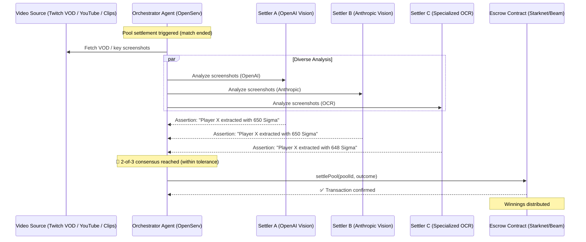

# Shōbu — Universal Esports Prediction Market Architecture

> **Vision:** A prediction market for any game on earth that doesn't need the publisher's permission.

---

## 1. The Problem: Walled Garden Data

Traditional esports prediction markets rely on official game APIs (Riot, Epic, Valve) for match data and settlement. This creates a fatal dependency:

| Publisher | API Available? | Allows Betting Use? |
|---|---|---|
| **Riot Games** (LoL, Valorant) | ✅ Full match history, live data | ❌ ToS explicitly prohibits gambling/betting |
| **Epic Games** (Fortnite) | ⚠️ Limited / no public match API | ❌ EOS terms prohibit gambling applications |
| **Neon Machine** (Shrapnel) | ❌ No public API at all | N/A — data doesn't exist publicly |
| **Valve** (CS2, Dota 2) | ✅ Steam Web API | ❌ Restricted for gambling after skin betting crackdown |

**Result:** Every publisher either blocks API access for betting or doesn't expose match data at all. API-dependent prediction markets are dead on arrival.

---

## 2. The Solution: AI Vision Swarm as a Permissionless Oracle

Instead of asking publishers for data, Shōbu **watches public video broadcasts** (Twitch VODs, YouTube clips, community screenshots) and uses a diverse AI agent swarm to parse match outcomes visually.

### Core Principle
> Publishers can revoke API keys. They cannot stop AI agents from watching a public video stream, reading "VICTORY" or "DEFEAT" on screen, and signing an on-chain settlement transaction.

### Why "API-Independent" (Not "Permissionless")
The architecture bypasses publisher API restrictions, but platform-level risks remain:
- **Twitch ToS** restricts gambling-related use of their API/platform
- **Publishers** can send cease-and-desist letters regardless of API usage
- **Mitigation:** The agents are platform-agnostic — they work with any public video source (YouTube, community uploads, direct screenshots). No single platform dependency.

---

## 3. Settlement Architecture: 2-of-3 Agent Consensus

### The Correlated Failure Problem
If all settler agents use the same AI model, they share the same blind spots. A Twitch compression artifact or custom streamer overlay could cause all three to hallucinate the same wrong outcome. Consensus doesn't help if the consensus is uniformly wrong.

### The Fix: Model Diversity

| Agent | Model | Rationale |
|---|---|---|
| **Settler A** | Gemma 4 (31B/26B MoE) | Open-weights check, different architecture, free via Google AI Studio |
| **Settler B** | Gemini 3 Flash | Proprietary/Closed-weights check, high speed, free via Google AI Studio |
| **Settler C** | Llama Vision (or similar) | Meta open-weights check, independent failure modes, free via Groq |

Three different neural pathways analyzing the same visual evidence. If 2-of-3 agree, confidence in the outcome is mathematically high.

### Settlement Flow



### Why Consensus Lives Off-Chain (MVP Pragmatism)

| Approach | Dev Time | Gas Cost | Trust Model |
|---|---|---|---|
| On-chain 2-of-3 multi-sig (Cairo) | Weeks | Higher (3 txns + verification) | Users trust the contract |
| Off-chain consensus via Orchestrator | Hours | Minimal (1 txn) | Users trust the operator |

**At MVP stage, the trust assumption is identical** — users trust the Shōbu system either way. The orchestrator holds the single escrow key and only calls `settle()` after receiving 2-of-3 matching assertions. On-chain multi-sig is a v2 upgrade when independent operators join.

---

## 4. The Polymarket Playbook: Market Mechanics

Polymarket is the gold standard for decentralized prediction markets. To build Shōbu with the same resilience and scalability, we adopt their three-pillar architecture—but swap their manual oracle for our AI vision swarm.

### 1. Hybrid Trading Architecture (The CLOB)
Polymarket doesn't put every bid and ask on-chain. That's too slow and expensive.
- **Off-chain Matching Engine:** Users sign limit orders (EIP-712) off-chain. An aggregator (like our OpenServ Orchestrator) matches buyers and sellers instantly.
- **On-chain Settlement:** Only the matched trades are submitted to the Escrow smart contract (on Starknet or Beam EVM). This gives users centralized order book speed with decentralized non-custodial security.

### 2. Market Structure (Conditional Token Framework)
Instead of a simple "pool" of funds, Shōbu should adopt the Gnosis Conditional Token Framework (CTF) model:
- **Tokenization:** When a market opens (e.g., "Will Player X extract?"), collateral (USDC) is locked, minting paired outcome tokens ("Yes" and "No").
- **1:1 Backing:** Every "Yes" and "No" pair equals $1.00 of collateral. 
- **ERC-1155 Standard:** Shares are fractional tokens priced between $0.00 and $1.00 based on market probability. If "Yes" is trading at $0.60, the market implies a 60% chance of extraction.

### 3. Settlement Mechanism (UMA Optimistic Oracle → AI Swarm)
This is where Shōbu innovates on the Polymarket formula.
- **The Polymarket Way:** Uses the UMA Optimistic Oracle. Humans propose a result with a financial bond. A 2-hour challenge window opens. If disputed, UMA token holders vote to resolve it.
- **The Shōbu Way (Agent-Assisted Optimistic Settlement):** 
    1. **Proposal:** Our 2-of-3 AI Vision Swarm (OpenAI, Anthropic, OCR) automatically analyzes the Twitch VOD and submits the outcome proposal to the contract.
    2. **Challenge Window:** An optimistic dispute window opens (e.g., 2 hours). 
    3. **Resolution:** If undisputed, the market settles. If challenged by a user (who stakes a bond), it escalates to community resolution or a higher-tier verifier.

By swapping the initial human proposal for our autonomous AI Swarm, Shōbu achieves faster, cheaper, and more scalable settlement while retaining the cryptoeconomic security of an optimistic challenge period.

---

## 5. Compute Economics

### The Optimization: VOD Analysis, Not Live Streaming

Running continuous frame-by-frame OCR on live video × 3 agents = unsustainable compute burn.

**Instead:**
1. **Analyst agent** monitors Twitch API for stream status / known tournaments
2. **When a pool's match ends**, orchestrator fetches 3-5 key screenshots from the VOD (victory screen, scoreboard, final moments)
3. **Each settler processes a handful of images**, not hours of video
4. **Cost per settlement: ~$0.10 - $0.50** (a few vision API calls)

This turns an expensive streaming workload into a lightweight, scalable micro-task.

---

## 6. Game Coverage: Two-Tier Strategy

### Tier 1: High-Volume Esports (LoL, Valorant, Fortnite, CS2, Dota 2)
- **Streams available 24/7** — thousands of concurrent channels
- **Pool types:** "Will [streamer] win their next ranked match?", "Over/under on kills", "First blood?", tournament predictions
- **Settlement:** AI vision swarm (API-independent by necessity due to ToS restrictions)
- **Volume play** — near-infinite supply of settleable pools

### Tier 2: Blockchain-Native Games (Shrapnel, upcoming Web3 titles)
- **Smaller streaming community** but crypto-native audience (low onboarding friction)
- **Pool types:** "Will [player] extract with >500 Sigma?", operator ownership bets, tournament brackets
- **Settlement:** Same AI vision swarm architecture
- **Narrative play** — "AI oracle for blockchain gaming" resonates with grants and ecosystem funds

### Stream Availability Matrix

| Game | Avg. Live Channels | Avg. Viewers | Coverage |
|---|---|---|---|
| League of Legends | 3,000-5,000+ | 120K-180K | 24/7 global |
| Valorant | 2,000-4,000+ | 80K-150K | 24/7 global |
| Fortnite | 3,000-6,000+ | 60K-120K | 24/7 global |
| CS2 | 2,000-4,000+ | 50K-100K | 24/7 global |
| Shrapnel | 20-100 | 500-2,000 | Event-driven |

---

## 7. OpenServ Agent Swarm Mapping

The existing Shōbu agent architecture maps directly to this system:

| Agent | Current Role | Esports Oracle Role |
|---|---|---|
| **Orchestrator** | Routes tasks between agents | Manages settlement consensus, tallies 2-of-3 votes |
| **Analyst** | Monitors on-chain events for pool opportunities | Monitors Twitch/streaming platforms for match events, proposes pools |
| **Pool Creator** | Deploys pool contracts | Deploys pool contracts with game-specific parameters |
| **Settler (×3)** | Settles pools from on-chain data | Each uses a different AI model to parse VOD → submits assertion |

No new agent types needed. The swarm just gains a video analysis capability and model diversity in the settler role.

---

## 8. Technical Challenges & Mitigations

### Game UI Variability
- **Problem:** Every game patch can change victory screens, scoreboards, UI layout
- **Mitigation:** Game-specific parsing profiles that agents reference; community can flag when a game updates its UI

### Streamer Overlays
- **Problem:** Custom overlays can obscure game elements
- **Mitigation:** Multiple screenshot analysis (different moments show different UI states); model diversity catches what one model misses

### Language / Regionalization
- **Problem:** Victory text varies by language (VICTORY, 勝利, VICTOIRE, VICTORIA...)
- **Mitigation:** Vision models are multilingual; OCR agent can be configured with multi-language dictionaries per game

### Adversarial Manipulation
- **Problem:** Someone could fake a stream or manipulate clips
- **Mitigation:** Cross-reference with known tournament brackets, community reports, and dispute windows (optimistic settlement with challenge period)

---

## 9. Competitive Landscape: How the Industry Does It Today

### The Traditional Data Supply Chain

```
Game Servers → Official Data Partners → Data Providers → Betting Platforms → Users
(Riot, Valve)   (GRID, tournament orgs)  (PandaScore)     (DraftKings, etc.)
```

Every layer adds cost, licensing requirements, and gatekeeping.

### The Key Players

| Provider | Method | Access Model | Cost |
|---|---|---|---|
| **GRID** | Direct publisher partnerships (Riot, Valve, ESL/FACEIT) | Enterprise licensing deals | $$$$$ (bespoke enterprise contracts) |
| **PandaScore** | **AI computer vision on live streams** + human trading team | B2B subscription | $$$$ (commercial license required) |
| **Sportradar** | Exclusive rights deals with publishers & leagues | Enterprise licensing | $$$$$ (legacy sports data giant) |

### The PandaScore Revelation

**PandaScore — a licensed, VC-backed esports data company — uses the exact same core approach as Shōbu's AI vision swarm.** Their AI watches live match broadcasts, uses computer vision to extract data points (kills, objectives, round wins, match outcomes), and combines this with human traders for verification.

This validates the entire Shōbu architecture at an industrial scale. The difference is positioning:

| | PandaScore | Shōbu |
|---|---|---|
| **AI Vision** | ✅ Proprietary CV models | ✅ Multi-model diverse swarm (OpenAI + Anthropic + OCR) |
| **Human verification** | ✅ In-house paid trading team | 🔄 Optimistic dispute window + community (v2) |
| **Licensing** | ✅ Colorado gambling license, ESIC partnership | ❌ Decentralized protocol — no single licensable entity |
| **Business model** | B2B data provider (sells to bookmakers) | B2C prediction market (users bet directly on-chain) |
| **Settlement** | Centralized (they are the oracle) | Semi-decentralized (agent consensus → smart contract) |
| **Cost to operators** | Enterprise subscription fees | Gas fees only |

---

## 10. The Full Bypass Stack

This is the complete picture of what traditional barriers exist in esports betting and how Shōbu sidesteps each one:

| Traditional Barrier | Who It Blocks | How Shōbu Bypasses It |
|---|---|---|
| **Publisher API ToS** (Riot, Epic ban betting use) | Any platform using official APIs | Vision swarm reads public broadcasts — no API key to revoke |
| **No public API** (Shrapnel, newer games) | Everyone | Same vision approach — API-independent by design |
| **B2B data provider fees** (GRID, PandaScore, Sportradar) | Small/indie platforms that can't afford $$$$$ enterprise contracts | Open agent swarm replaces a paid data provider entirely |
| **Gambling licensing** (Colorado, Malta, UK, etc.) | Any centralized entity operating a betting platform | Decentralized protocol — no single licensable entity (Polymarket/Uniswap precedent) |
| **Centralized oracle risk** (single data provider = single point of failure) | All centralized settlement systems | Model-diverse 2-of-3 consensus with independent neural architectures |
| **Publisher takedowns** (C&D letters, platform pressure) | Centralized companies with known operators | **Protocol vs. Client:** The smart contracts and Oracle swarm operate permissionlessly. While a hosted frontend (*Client*) can be geofenced, the settlement infrastructure (*Protocol*) remains completely unstoppable. |

### What This Means

PandaScore charges enterprise rates for what Shōbu does with an open agent swarm. GRID requires publisher partnerships that take months to negotiate. Sportradar operates in a walled garden of exclusive rights deals.

Shōbu replaces this entire B2B data supply chain with a decentralized, AI-driven oracle layer that anyone can run. The data source is the one thing no publisher can restrict: **public video broadcasts.**

---

## 11. Roadmap

### V1 (MVP — Current)
- [ ] Orchestrator enforces 2-of-3 consensus off-chain
- [ ] Single game support (Shrapnel or LoL as pilot)
- [ ] Manual pool creation by analyst agent
- [ ] VOD screenshot analysis for settlement

### V2 (Scale)
- [ ] Multi-game support with game-specific parsing profiles
- [ ] Automated pool creation from tournament schedules
- [ ] On-chain multi-sig settlement (independent operators)
- [ ] Dispute/challenge window for contested outcomes

### V3 (Decentralize)
- [ ] Open settler operator slots to third parties
- [ ] Token-staked settlement (slashing for wrong assertions)
- [ ] Community governance for game profile updates
- [ ] Cross-chain pool deployment (Starknet + Beam + others)

---

## 12. The Pitch

> Web2 gaming giants actively block prediction markets by restricting API access. Traditional data providers like PandaScore and GRID charge enterprise rates and require gambling licenses to access match data. Shōbu bypasses the entire supply chain. By using an autonomous, multi-model AI vision swarm to analyze public broadcasts, we turn public video streams into cryptographic settlement data — doing what PandaScore sells for enterprise fees, but as an open, decentralized protocol. We can create prediction markets for any game on earth, and we don't need the publisher's permission or a data provider's invoice to do it.

**What Shōbu is:** A universal, API-independent game oracle powered by diverse AI consensus — the decentralized alternative to the PandaScore/GRID/Sportradar data cartel.

**What Shōbu is not:** Dependent on any publisher, platform, data provider, or API key that can be revoked.
